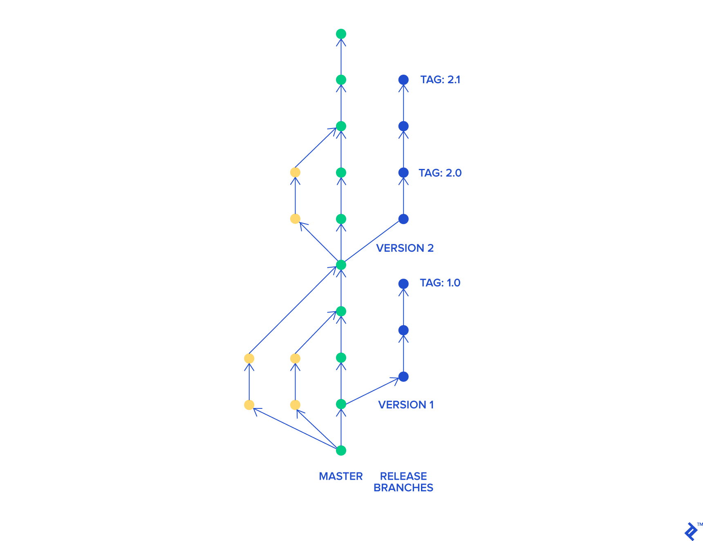

## Trunk based development (with release candidates)

#### Main

    Indeholder alle færdige features
    
    Bliver brugt som default branch

#### Feature

    Brancher ud fra main
    
    Repræsenterer en task
    
    Pull changes fra main hver dag
    
    Pull Request tilbage til main
    
    Squash & Merge til main

#### Release

    Laves ud fra Main
    
    Når branchen er lavet bliver den sat i test
    
    Hvis der er fejl på en feature, skal der hotfixes til release
    
    Når alle features er godkendt i release branchen sættes branchen i preprod
    
    Efter release er godkendt og i produktion skal hotfix cherry pickes til main

    

Trunk based development (with release candidates)
Main
Indeholder alle færdige features

Bliver brugt som default branch
Feature
Brancher ud fra main

Repræsenterer en task

Pull changes fra main hver dag

Pull Request tilbage til main

Squash & Merge til main
Release
Laves ud fra Main

Når branchen er lavet bliver den sat i test

Hvis der er fejl på en feature, skal der hotfixes til release

Når alle features er godkendt i release branchen sættes branchen i preprod

Efter release er godkendt og i produktion skal hotfix cherry pickes til main
