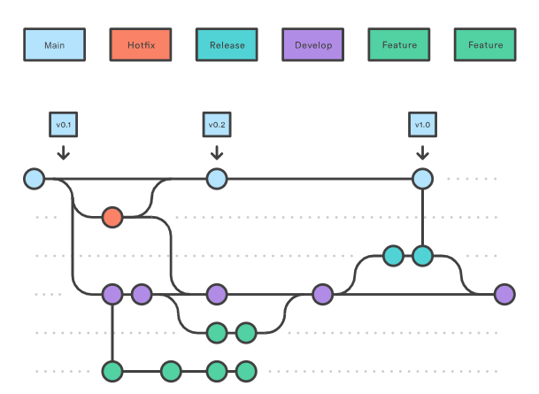
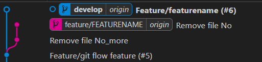

## Git flow - TECO

### Develop branch
- Bliver brugt som udgangspunkt for alle features
- Svarer til udviklernes interne version
- Bliver altid deployet til test-environment når en ny feature er færdig

### Feature branches:
- Svarer til en enkelt jira-task
- Laves ud fra develop og rebases tilbage til develop
- Når en feature branch er færdig og skal rebases, skal vi altid squashe commits
- Feature branches skal være isolerede og ikke kræve sammenspil med andre features for at fungere efter den er rebased til develop

### Release branches
- Bliver oprettet når teamet enten har en planlagt release på vej, eller nok features vi gerne vil have ud (eventually)
- Når der bliver oprettet release branch får vi alle færdiggjorte features med fra develop.
- I release branchen bliver alle features der ikke er testet reverted-
- Når alt i releasen er markeret testet færdiggøres release branchen med et merge til main og develop.

### Main branch
- Main branchen er hvad der ligger i produktion
- De eneste brances der merges ind i main er release branches
- Nårder bliver merget release til main deployer vi main til test + preprod til final testing.
- Findes der fejl i final testing vurderes det om vi kan rette hurtigt
- Hvis vi kan så laver vi hotfix og merger til main+dev
- Hvis ikke så reverter vi merge til main, og arbejder på et fix ud fra develop.

### Hotfix brances
- Hotfixes branches laves fra main, og rebases på main og develop
- De bruges kun som nødstilfælde, og skal approves af minimum to udviklere

## Feature flow

Feature branch flow: 
    git flow feature start BRANCHNAME

    git commit -m "Made some code"

    git push -u origin BRANCHNAME

    git rebase origin/develop

I github:

    Lav pull request til develop
    Squash og merge når du afslutter PR

Det resulterer i:
    
    - En enkelt parent på et feature commit
    - Et enkelt commit på develop, som er nemt at reverte
    - Ingen branch-spaghetti

## Release flow

    git flow release start 1.0
    
Deploy til test

Når alle features er testet og approved

    git flow release finish

Dette merger release til develop og til main.

Deploy main til test + preprod, afvent release.